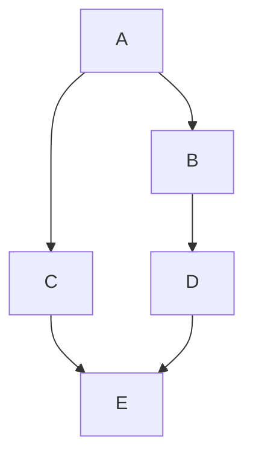

# 第2回講座で学んだこと #
* SVNとGitの違い
* mainブランチに変わった理由
* 「Git-Flow」と「GitHub-Flow」の違い

# Markdown記法 #

### ■改行のマークダウン記法 ###
行末で「半角スペース」を  「2個」連続入力する

### ■見出しのマークダウン記法 ###
文章の冒頭に「#」を入力する
# h1（見出し1） #
## h2（見出し2） ##
### 「#」が増えるごとに小さくなっていく ###

### ■箇条書きのマークダウン記法 ###
羅列した文章の前に、それぞれ「*」（アスタリスク）をつける
* AWS Cloud9 は
* ブラウザのみでコードを記述、実行、デバッグできる
* クラウドベースの統合開発環境 (IDE) です

### ■ナンバーリングのマークダウン記法 ###
羅列した文章の前に数字とピリオドを入力する
1. ブラウザのみでコードを記述
2. リアルタイムに共同でコーディング
3. サーバーレスアプリケーションを簡単に構築
4. AWS のサービスに直接ターミナルアクセス

### ■水平線のマークダウン記法 ###
「*」アスタリスク・「-」ハイフン・「＿」アンダーバーを、3つ以上入力すると「水平線」を表示できる
***
----
_____

### ■チェックボックスのマークダウン記法 ###
チェックボックスを表示させたいときは、項目の頭に‐（ハイフン）と［ ］（大カッコ）を入力する
‐［x］はい　‐［ ］いいえ

### ■強調のマークダウン記法 ###
文章の強調したい部分を「」アスタリスク2個ずつで挟むと、**「大文字」**に表示できる

### ■斜体のマークダウン記法 ###
変更したい部分を「」アスタリスク1個ずつで挟むことで、*「斜体」*に表示できる

### ■引用のマークダウン記法 ###
引用元の前に「>」を入力することで
>引用表記できる

### ■ハイパーリンクのマークダウン記法 ###
[テキスト](URL)と入力することで、［］内に入力した文章を、指定したURLへリンクできる
[Rubyドキュメント](https://www.ruby-lang.org/ja/documentation/)

### ■画像のマークダウン記法 ###
と入力することで、「画像」を表示することができる

# Marmaid記法 #

   