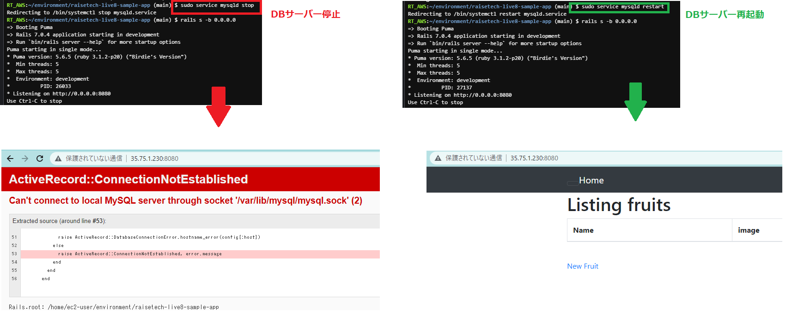

# 第3回課題 #
## サンプルアプリケーションのデプロイ ##
1.  インシデント設定を4→2へ
2. EC2 の EBS サイズを 10GB→30GBへ
3. 最新MySQLをインストール
  ・MYSQL_PACKAGE_URL="https://dev.mysql.com/get/mysql80-community-release-el7-7.noarch.rpm"
```bash
sudo yum localinstall -y $MYSQL_PACKAGE_URL
sudo yum install -y mysql-community-devel 
sudo yum install -y mysql-community-server
```
・MySQLサーバーの起動＆確認
```bash
sudo service mysqld start && sudo service mysqld status
```
・ログイン確認
```bash
mysql -u root -p
```
4. Railsインストール
```bash
echo "gem: --no-document" >> ~/.gemrc 
```
5.サンプルAPPをclone
```bash
git clone https://github.com/yuta-ushijima/raisetech-live8-sample-app.git
```
6. サンプルAPPのディレクトリに移動して、Bundlerインストール
```bash
bundle install
```
7. データベースを作成して、アプリのmigrationファイルに記載されたテーブル作成
```bash
rails db:create
rails db:migrate
```
8. アプリ実行
```bash
rails s -b 0.0.0.0　　＊bindオプションを使えば、リスニングするIPを指定することができる
```
9. ブラウザにて「http://EC2のパブリックIPアドレス:8080/」  にアクセスする
10. 起動したアプリ内にて、fruitデータの新規追加・更新・削除操作OK
***
＜バージョン＞
Ruby：3.1.2
Rails：7.0.4
bundler：2.3.14
***

### 遭遇したエラー ###
*config/database.ymlがない*
ファイル名を「/database.yml.sample」→「database.yml」に変更

*MySQLサーバーつながらないエラー*
 「config/database.yml」の socket: /tmp/mysql.sock　→　socket: /var/lib/mysql/mysql.sock に変更
 
*「このサイトにアクセスできません」エラー*
Cloud9のEC2にセキュリティーグループにインバウンドルールを設定　→　SSH、HTTP、HTTPS、8080を開放

*アセットパイプラインに「application.css」が見つからないエラー*
①下記コマンドでyarnインストール→　1.22.19入る
```bash
npm install --global yarn
```
②改めてscssの手動コンパイル実施　→　「application.css」作成される
```bash
rails assets:precompile
```


## AP サーバーについて調べてみましょう。 ##
### AP サーバーの名前とバージョンを確認してみましょう。 ###
```bash
Puma version: 5.6.5 (ruby 3.1.2-p20) ("Birdie's Version")
```
### AP サーバーを終了させた場合、引き続きアクセスできますか？ ###
```bash
「このサイトにアクセスできません」エラーが表示されました。
```
### 結果を確認して、また AP サー バーを起動してください。 ###
```bash
アプリにアクセスできるようになり、アプリ内の操作もできました。
```


## DB サーバーについて調べてみましょう。 ##
### サンプルアプリケーションで使った DB サーバー（DB エンジン）の名前と、今 Cloud9 で動作 しているバージョンはいくつか確認してみましょう。 ###
```bash
DB エンジン：MySQL　　Server version：8.0.31
 ```
### DB サーバーを終了させた場合、引き続きアクセスできますか？ ###
```bash
MySQLに接続できないエラーが表示され、アクセスできませんでした。
```


## Rails の構成管理ツールの名前は何でしたか？ ##
```bash
bundler
```