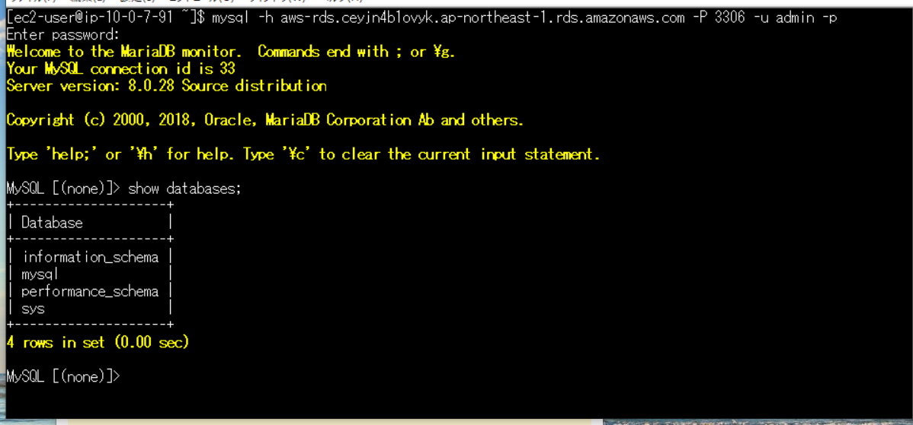

# 第4回課題 #
## VPC,EC2,RDSの作成 ##
1. VPC作成する
2. EC2 ⇨ セキュリティグループにてセキュリティグループを作成しインバウンドのルールを設定する
3. RDS ⇨ セキュリティグループにてセキュリティグループを作成しインバウンドのルールを設定する
4. EC2インスタンスを作成する
5. RDS ⇨ サブネットグループにてサブネットグループを作成する
6. RDS作成する

## EC2とRDSの接続確認 ##
1. Amazon LinuxにSSH接続する
2. cd ~　でrootディレクトリに移動
3. yum update -y　でコマンドをUPデート
4. yum install mariadb　でｍｙSQLをインストール
5. RDSのエンドポイントに　mysql -h aws-rds.ceyjn4b1ovyk.ap-northeast-1.rds.amazonaws.com -P 3306 -u admin -p　でアクセス
6. RDS作成時に決めたPWを入れる
7. MySQL起動を確認する

## 遭遇したエラー ##
「mysql -uroot -p -h aws-rds.ceyjn4b1ovyk.ap-northeast-1.rds.amazonaws.com」にてアクセス時
パスワード入力後、下記エラーが表示された。
Authentication plugin 'caching_sha2_password' cannot be loaded  
    ↓  
「mysql -h aws-rds.ceyjn4b1ovyk.ap-northeast-1.rds.amazonaws.com -P 3306 -u admin -p」に変更して
MySQL内に入るようになった。

＜エビデンス＞

## 今回の課題から学んだこと ##
* VPC,EC2,RDSの作成方法を改めて確認しながらまとめられて良かったです！
* 'caching_sha2_password'エラーが消えたのは、今回ユーザー名が「admin」だったから。。と思っています。
* 構成のイメージはできるようになってきました。