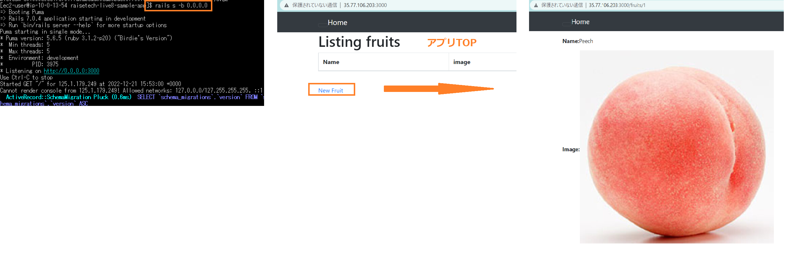
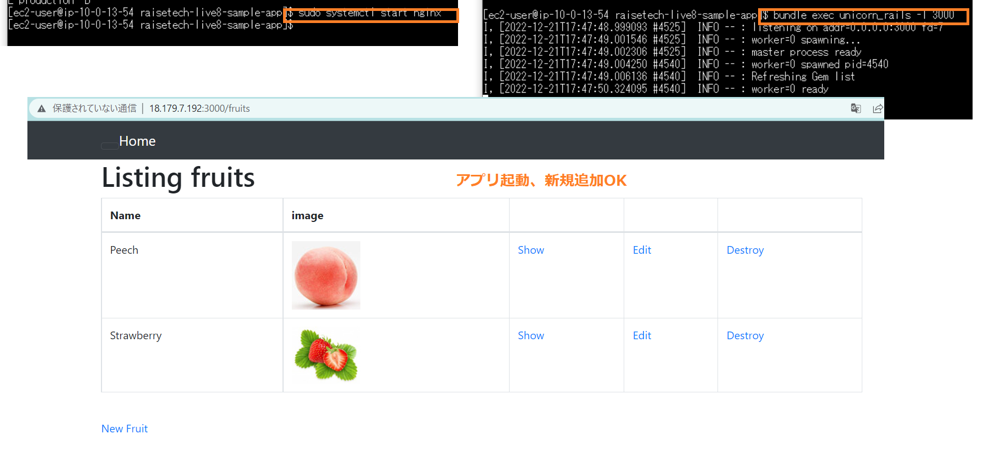

# 第5回課題 #
## 組み込みサーバーだけで動かす ##
1. パッケージをアップデート
2. Railsアプリが動くよう必要なパッケージをインストール
3. JavaScriptを実行できるようNode.jsをインストール
4. Rails6以降はyarnを使うので、yarnもインストール
5. rubyのバージョン管理ツールrbenvをインストール
6. rubyをインストールするためのruby-buildをインストール
7. rubyをインストール
8. MySQLをインストール
9. Railsインストール
10. サンプルAPPをclone
11. サンプルAPPのディレクトリに移動して、Bundlerインストール
12. RDSに接続するために「config/database.yml」を修正
13. データベースを作成する
14. scssの手動コンパイル実施
15. アプリ実行
```bash
rails s -b 0.0.0.0
```
16. ブラウザにて「http://EC2のパブリックIPアドレス:3000/」 にアクセス  
     ↓  
アプリが操作できる

＜エビデンス＞


### この作業から学んだこと ###
* MySQLが入らない時、wgetを使ってインストールする方法
* database.yml記載の意味
* credential管理による環境変数の設定の仕方  
 （結局、/credentials.yml.enc復号化できなかったので時間あったら再挑戦したいです。）

## サーバー/アプリケーションを分けて動かす ##
1. Nginxをインストール
2. Nginxの権限を変更
3. Unicornのインストール
4. Nginxを再起動
```bash
sudo service nginx restart
```
5. Unicornを起動
```bash
bundle exec unicorn_rails -l 3000
```  
↓  
アプリが操作できる

＜エビデンス＞


### この作業から学んだこと ###
* 改めてLinuxコマンドが学び直せた
* viエディタの使い方　便利！と思えるようになった。
* listenポートを指定しないとアクセスできなかったのが少し不思議。。

