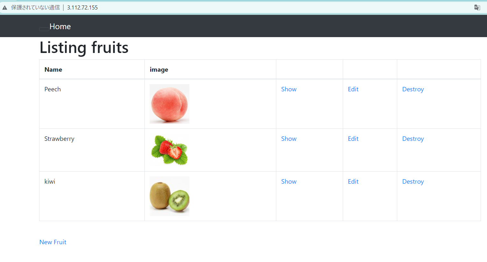

## ALB経由でアクセスする ##
1. ロードバランサーの種類を選択 (ALB)
2. 名前を決めて、「スキーム：Internet-facing」「アドレスタイプ：IPv4」選択
3. ターゲットのEC2があるVPCを選択
4. EC2で利用中のAZ（1a,1c）＋パブリックサブネットを選択　
5. セキュリティーグループを作成して選択する
  - インバウンドルールにて「HTTP  TCP  80」のみ設定
  - ソース：0.0.0.0/0
  - Railsアプリを組み込みサーバーで起動しているときは、3000ポート追加必要
6. リスナーは「HTTP：80」を選択
  - Railsアプリを組み込みサーバーで起動しているときは、3000ポート追加必要
7. ターゲットグループを作成して選択する
  - ターゲット種類：インスタンス
  - プロトコル：HTTP　80
  - VPC：ターゲットのEC２があるVPC
  - ヘルスチェック：HTTP　パス：「/」
  - Railsアプリを組み込みサーバーで起動しているときは、3000ポート追加必要
8. Available instances：対象にしたいEC2を選択し「include as pending below」押下
9. ターゲットEC2にてアプリを　Nginx+Unicorn　で起動する
10. ALBのDNSをコピーしてブラウザからアクセスする

＜エビデンス＞


### この作業から学んだこと ###
* ALBの作成方法
* Puma起動とNginx＋Unicorn起動でポート番号を変える必要がある
* assetsファイルは「/home/ec2-user/raisetech-live8-sample-app/public/assets」に入っている

### 遭遇したエラー ###
1. nginxの「index.html」しか表示されない  
  「/usr/share/nginx/html」以下にある「index.html」が表示されているので正しい動作  
  ターゲットグループもHealthyになっている
 - EC2 のセキュリティグループにてインバウンドルール：80を追加し、ソースをALBのセキュリティグループにする  
   →　自身がEC2 に入るときもIPアドレスで入れなくなる  
   →　セキュリティーを高める為の設定と判明したので、一旦削除

 - /etc/nginx/conf.dディレクトリ以下にconfファイルがなかったので作成してみる  
   →　DNSでアクセスすると「**502 Bad Gateway**」　ターゲットグループもUnhealthy  
      EC2のIPアドレスでアクセスすればアプリ見られる
   →　作成したconfファイルを消すと、nginxの「index.html」が表示される

- 組み込みサーバーで起動して　ALBのDNSアドレス　でアクセス  
   →　502 Bad Gateway

- 組み込みサーバーで起動して　ALBのDNSアドレス:3000　でアクセス
  →　応答時間が長すぎてアクセスできない

- ヘルスチェックのパスを「/」→「/home/ec2-user/raisetech-live8-sample-app」に変えてみる  
  →　502 Bad Gateway　のまま

- ALBのリスナールールをリダイレクト設定してみる

```
**Redirect to**　 HTTP://#{host}:3000/#{path}?#{query}
```  
 →　応答時間が長すぎてアクセスできない  
    ＊自動で3000が付く「http://aws-elb-1205846302.ap-northeast-1.elb.amazonaws.com:3000/」

- ALBのリスナールールは100％ターゲットグループにして  
　ターゲットグループ側でEC2インスタンスがLISTENしているポート番号を指定する  
 →　Nginx起動しなくても、ヘルスチェックがHealthyになった！  
    しかし、応答時間が長すぎてアクセスできない

- ALBのリスンポートを3000にして、リスナールールは100％ターゲットグループにする  
  ターゲットグループのリスナーも3000ポートにする  
  ALBのセキュリティグループでもインバウンドルールに3000を追加する  
 →　「Blocked host: aws-elb-1205846302.ap-northeast-1.elb.amazonaws.com」が表示される  
 →　Rails6へのアップデート時の変更点の一つである[「**DNSリバインディング攻撃からの保護」**という機能が原因  
`config/environments/development.rb`に下記を記載し、ホワイトリストに許可したいhostを追加する

```
Rails.application.configure do
（中略）
  config.hosts << "<許可したいホスト名>"
（中略）
end
```

2. ALB経由でDNSでアクセスし、組み込みサーバー（Puma）で起動しているアプリが操作できるようになった！　が…ヘルスチェックがUnhealthy- 
- ヘルスチェックのポートをOverrideにして「3000」に変更  
 →　ヘルスチェックもHealthyになった！

3. Nginx＋Unicornで起動した状態でALB経由でアクセスできたが、スタイル崩れた。  
 →　参照しているcssとjsが見つからないエラ-  
 →　nginx設定ファイルのassets設定をコメントアウトして解消