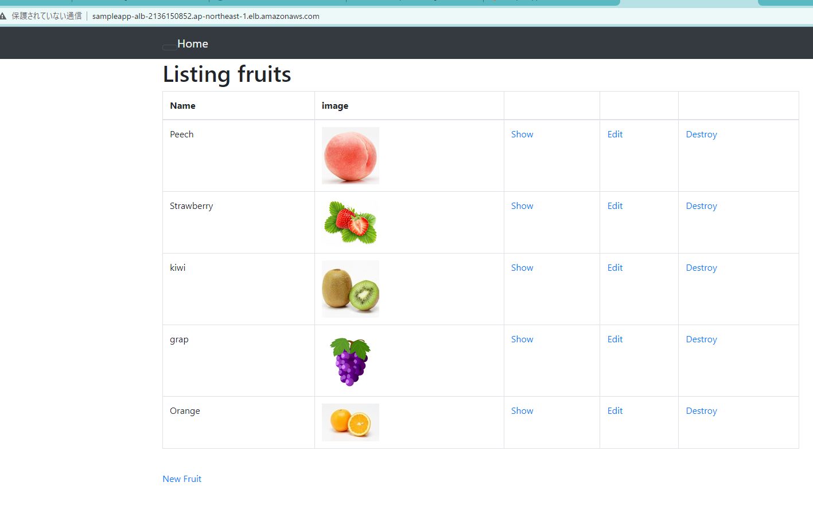
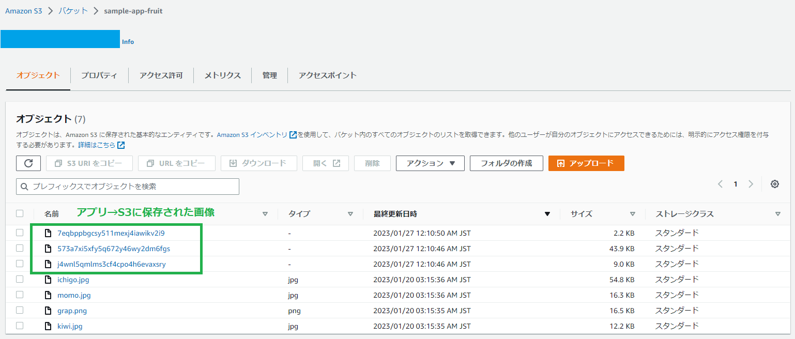

## 画像の保存先をS3にする ##
### S3バケット作成方法 ###
1. S3のコンソールにて「バケットを作成する」を押下する
2. バケット名の入力部分に任意のバケット名を入力する
3. リージョンはアジアパシフィック(東京)を選択する  
   ＊バケット名は世界で一意のバケット名にする必要があります。

4. アクセス権限設定では「パブリックアクセスを全てブロック」からチェックを外し  
   注意書き！「パブリックアクセスのブロックをすべてオフにすると、このバケットとバケット内のオブジェクトが公開される可能性があります。」にチェックを入れる

5. 今回、バケットのバージョニングは「無効」にする  
   ＊バージョニングを使用すると、意図しないユーザーアクションと意図しないアプリケーション障害の両方から簡単に復旧できる
6. 暗号化、詳細設定はそのまま「バケットを作成」をクリックする。
7. バケット一覧から只今作成されたバケット名をクリックして「フォルダの作成」をクリックする。
 
### IAMユーザーの作成方法 ###
 [必要最小限の権限を与える為、S3接続用にIAMユーザーを作成する](https://www.jpcyber.com/support/create-iam-user-and-iam-policy)
1. IAMコンソールにて「ユーザー」を選択
2. 「ユーザー作成」を押下する
3. 「AWS 認証情報タイプ」をアクセスキー - プログラムによるアクセス選択
4. 既存のポリシーから　「AmazonS3FullAccess」を選択して追加  
[＊本番環境では権限を制限しておいたほうが良い](https://qiita.com/daichi41/items/a045ac60fa087a9763ba)
 

### バケットポリシーの設定 ###

[バケットポリシーとは](https://qiita.com/iwkmsy9618/items/d277f5f6f3991ada70f1#%E3%83%90%E3%82%B1%E3%83%83%E3%83%88%E3%83%9D%E3%83%AA%E3%82%B7%E3%83%BC)   
どのようなアクセスに対してS3への保存やデータの読み取りを許可するか決められる仕組みです。  
今回は「IAMユーザー」からのアクセスのみを許可するように設定します。

1. S3コンソールにて作成したバケットを選択する
2. バケットポリシーの「編集」を押下する
3. バケットポリシーエディターに以下JSONを貼り付ける
```
{
   "Version": "2012-10-17",
   "Statement": [
       {
           "Sid": "Stmt1",
           "Effect": "Allow",
           "Principal": {
               "AWS": "arn:aws:iam::334004269495:user/RT_AWSs"  *S3アクセス用のIAMユーザーのARN
           },
           "Action": "s3:*",
           "Resource": "arn:aws:s3:::sample-app-fruit"　　＊S3バケット名
       }
   ]
}

```
### 画像がS3のバケットに保存されるようにapp側を設定 ###

1. 必要なgemを記述し`bundle install`する  
   ＊サンプルアプリにはすでに入っていたので、`bundle install`　済み！
```
gem "aws-sdk-s3", require: false
```
2. 「config/environments/development.rb」にて画像の保存先をローカル→　S3に変更する
```
~略~
config.active_storage.service = :amazon
~略~
```
3. 「config/storage.yml」に以下を記述する  
    ＊すでに変数として入っていた

```
amazon:
 service: S3
 access_key_id: <%= Rails.application.credentials.dig(:aws, :access_key_id) %>
 secret_access_key: <%= Rails.application.credentials.dig(:aws, :secret_access_key) %>
 region: ap-northeast-1
 bucket: <%= Rails.application.credentials.dig(:aws, :active_storage_bucket_name) %>

```
4. AWS S３の認証情報を「credentials.yml.enc」に追加する  
  「config/storage.yml」にて環境変数を使用している為credentialsを使ってrailsにAWSのアクセス情報を教える必要があるため

- master.keyが不明な場合、新たに作成したい場合は、あらかじめ「credentials.yml.enc」を削除しておくと、master.key含めて新規作成される  
  `$ rm config/credentials.yml.enc`

- `config.active_storage.service = :amazon`の記述があると、RailsはActiveStorageを利用している際にS3へ接続しにいく。  
  そのとき、Rails5.2以降では「credentials.yml.enc」に記載がないか情報を読みに行く。

```
# 「credentials.yml.enc」を編集するコマンド
#「credentials.yml.enc」がない場合は新規作成される
$ EDITOR=vi rails credentials:edit

#以下を追記
aws:
  access_key_id: 先ほど控えたもの
  secret_access_key: 先ほど控えたもの
	active_storage_bucket_name: 作成したS3バケット名
```
5. アプリをNginx＋Unicornで起動する
6. ALB経由でアクセスし、アプリが表示されたら、画像を新規追加する
7. アプリに追加画像が表示され、S3バケット内に画像データーが追加されたことを確認する

＜エビデンス＞



### この作業から学んだこと ###
* S3バケットの作成方法
* credentials管理の仕組み、キーの生成・設定の仕方
* ymlファイルに慣れてきた

### 遭遇したエラー ###
1. 「ArgumentError in Fruits#index」が表示される  
    エラー内容：`missing required option :name`  
  →　config.active_storage.service = :local  に戻すと解消する
- S3バケットに初期で表示される登録済み画像を追加してみたが同じ
- 「config/storage.yml」に環境変数を使わないでアプリ実行してみる  
  →　アプリ開けて、画像追加もできた  
  → 「access_key_id」「secret_access_key」は環境変数に戻したら、その旨のエラーでたのでcredentials情報を使おうとはしている？　　
　→　再度環境変数使用に戻したら同じエラー
- [下記](https://software.fujitsu.com/jp/manual/manualfiles/m120016/b1ws1045/01z200/b1045-00-10-21-01.html)によると空白が入っている？→　バケット名の最後の空白消したが同じ
- RailsコンソールからアクセスIDを呼び出すことができるか確認

```
$ rails c

irb(main):001:0> Rails.application.credentials.dig(:aws, :access_key_id)
=> 123

irb(main):002:0> Rails.application.credentials.dig(:aws, :secret_access_key)
=> 345

irb(main):003:0> Rails.application.credentials.dig(:aws, :active_storage_bucket_name)
=> S3バケット名

irb(main):004:0> exit
```
  →「secret_key_base」「access_key_id」「secret_access_key」「active_storage_bucket_name」ともにnil
- 環境変数：RAILS_MASTER_KEYで「master key」を設定したがnil  
  →　EC2では $ export RAILS_MASTER_KEY="xxx"で設定したら読み込めなくなるそう。。
[https://www.dragonarrow.work/articles/159](https://www.dragonarrow.work/articles/159)

```
$ export RAILS_MASTER_KEY="xxxxxxxxxxxxxxxxxxxxxxxxxxxxxxxx"
$ rails c

irb(main):001:0> Rails.application.credentials.secret_key_base
=> 設定値が表示される
```

- 「credentials.yml.enc」と「master.key」を消して`$ EDITOR="vi" bin/rails credentials:edit`にて作成しなおす  
  →　`Rails.application.credentials.dig(:aws, :access_key_id)`　が依然として「nil」
- configディレクトリ配下のファイルを編集後、consoleやrails serverを再起動させる  
  →　「credentials.yml.enc」新規作成・設定後`$ rails s -b 0.0.0.0`　や　`$ rails restart`　しても同じ  
- 「config/credentials/development.yml.enc」に記載する  
  →　「development.key」なかったので`EDITOR=vi rails credentials:edit --environment development`にて生成する  
  →　「config/credentials/development.yml.enc」にS3の情報を記載する  
  →　Railsコンソールから各秘匿情報にアクセスOKになる！