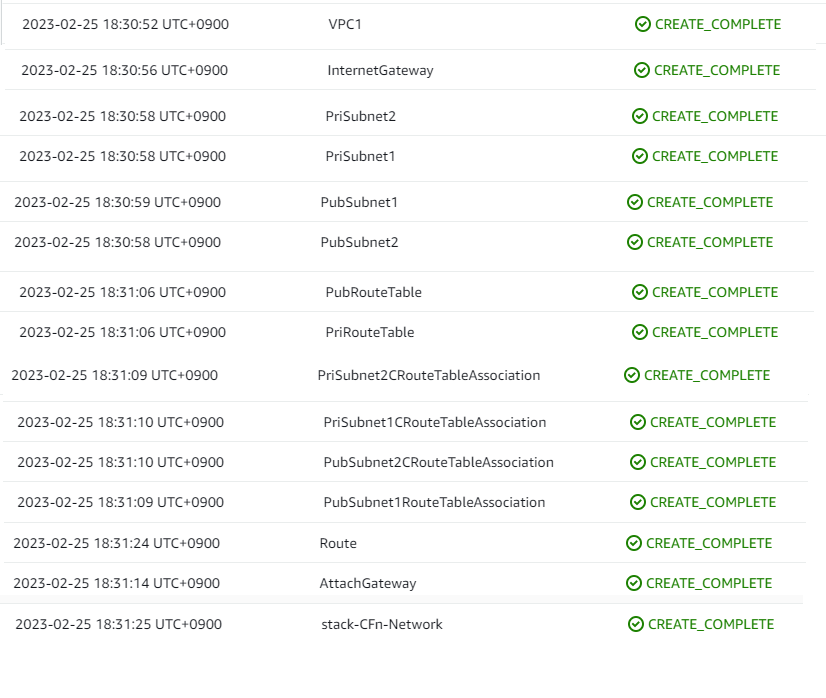
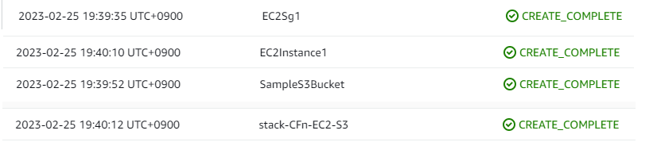
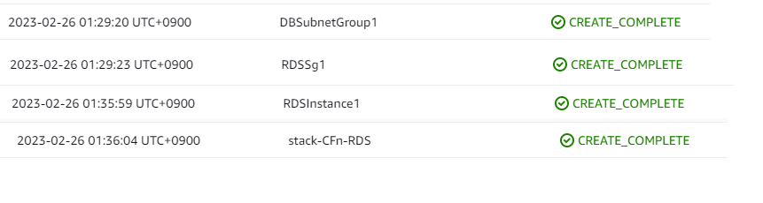

# 第10回課題 CloudFormation #
## VScodeのインストール＆設定 ##
1. VScodeをインストールする
2. 拡張機能にて以下を入れる  
  **Japanese Language Pack for Visual Studio Code**   
  **AWS CloudFormation YAML Template Maker**  
  **YAML**

3. CloudFormationの記述を認識させるため「settings.json」に以下の設定を追加
```
"yaml.schemas": {
  "https://d33vqc0rt9ld30.cloudfront.net/latest/gzip/CloudFormationResourceSpecification.json": [
            "*.cf.yaml",
            "*.cf.yml",
            "*.cfn/*.yaml",
            "*.cfn/*.yml",
            "cloud*formation/*.yaml",
            "cloud*formation/*.yml"
        ]
    },
"yaml.customTags": [
    "!Ref",
    "!Sub scalar",
    "!Sub sequence",
    "!Join sequence",
    "!FindInMap sequence",
    "!GetAtt scalar",
    "!GetAtt sequence",
    "!Base64 mapping",
    "!GetAZs",
    "!Select scalar",
    "!Select sequence",
    "!Split sequence",
    "!ImportValue",
    "!Condition",
    "!Equals sequence",
    "!And",
    "!If",
    "!Not",
    "!Or"
  ]
```
## Network関連のテンプレートを作成する ##
1. VPCの作成
まず全ての入れ物を作る（アドレスの範囲を設定 ※あとから変更できない）  
[AWS::EC2::VPC　のプロパティ仕様](https://docs.aws.amazon.com/ja_jp/AWSCloudFormation/latest/UserGuide/aws-resource-ec2-vpc.html#cfn-aws-ec2-vpc-instancetenancy)  

2. Subnetの作成  
次に小分け袋を作る（（Network ACLにより、どこと通信できるか設定）  
こちらもSubnetごとにアドレスを設定できる  
AZごととprivateごとにsubnetを作る  
[AWS::EC2::VPC　のプロパティ仕様](https://docs.aws.amazon.com/ja_jp/AWSCloudFormation/latest/UserGuide/aws-resource-ec2-subnet.html)  

3. Route Tableの作成  
Subnet間や外部通信用の設定、SubnetとInternet Gatewayの設定をする  
　＊Public、Private2つ作成する  
[AWS::EC2::RouteTable　のプロパティ仕様](https://docs.aws.amazon.com/ja_jp/AWSCloudFormation/latest/UserGuide/aws-resource-ec2-subnet.htm)  
[AWS::EC2::SubnetRouteTableAssociation　のプロパティ仕様](https://docs.aws.amazon.com/ja_jp/AWSCloudFormation/latest/UserGuide/aws-resource-ec2-subnetroutetableassociation.html)    

4. Internet Gatewayの作成  
インターネットと通信することをRoute Tableに許可する  
VPCにアタッチして、Route Tableに紐づける  
[AWS::EC2::InternetGateway　のプロパティ仕様](https://docs.aws.amazon.com/ko_kr/AWSCloudFormation/latest/UserGuide/aws-resource-ec2-internetgateway.html)  
[AWS::EC2::VPCGatewayAttachment　のプロパティ仕様](https://docs.aws.amazon.com/ja_jp/AWSCloudFormation/latest/UserGuide/aws-resource-ec2-vpc-gateway-attachment.html)  
[AWS::EC2::Route　のプロパティ仕様](https://docs.aws.amazon.com/AWSCloudFormation/latest/UserGuide/aws-resource-ec2-route.html)  

5. Outputs　の設定  
他のテンプレートから参照させるための設定をする  
VPC、Subnet×４つ設定した  
[記載ルール](https://docs.aws.amazon.com/ja_jp/AWSCloudFormation/latest/UserGuide/outputs-section-structure.html)  

## EC2のテンプレートを作成する ##
1.  Parameters　の設定  
テンプレートファイル内で使う値をまとめて記述しておくことができる  
```
Parameters:
  Ec2ImageId:　←初期値でOKであれば未設定でもOK
    Type: AWS::SSM::Parameter::Value<String>
    Default: /aws/service/ami-amazon-linux-latest/amzn2-ami-hvm-x86_64-gp2
  SSHLocation:
    Description: IP address range that can be used to SSH to the EC2 instances
    Type: String
    MinLength: '9'
    MaxLength: '18'
    Default: 0.0.0.0/0
    AllowedPattern: (\d{1,3})\.(\d{1,3})\.(\d{1,3})\.(\d{1,3})/(\d{1,2})
    ConstraintDescription: must be a valid IP CIDR range of the form x.x.x.x/x.
```
2. EC2用のセキュリティグループの作成  
[AWS::EC2::SecurityGroup　のプロパティ仕様](https://docs.aws.amazon.com/ja_jp/AWSCloudFormation/latest/UserGuide/aws-properties-ec2-security-group.html)  
[AWS::EC2::SecurityGroup Ingress　のプロパティ仕様](https://docs.aws.amazon.com/ja_jp/AWSCloudFormation/latest/UserGuide/aws-properties-ec2-security-group-rule-1.html)   
TCP22,80,443,3000 に対して以下を設定した  
「IpProtocol」「FromPort」「ToPort」「CidrIp」 

3. EC2 Instance　の作成  
[AWS::EC2::Instance　のプロパティ仕様](https://docs.aws.amazon.com/ja_jp/AWSCloudFormation/latest/UserGuide/aws-properties-ec2-instance.html#cfn-ec2-instance-disableapitermination)  

5. Outputs　の設定    
EC2  Instanceのみ設定した  
[記載ルール](https://docs.aws.amazon.com/ja_jp/AWSCloudFormation/latest/UserGuide/outputs-section-structure.html)

## ALBのテンプレートを作成する ##
1. Parameters　の設定  
```
Parameters:
  SSHLocation:
    Description: IP address range that can be used to SSH to the EC2 instances
    Type: String
    MinLength: '9'
    MaxLength: '18'
    Default: 0.0.0.0/0
    AllowedPattern: (\d{1,3})\.(\d{1,3})\.(\d{1,3})\.(\d{1,3})/(\d{1,2})
    ConstraintDescription: must be a valid IP CIDR range of the form x.x.x.x/x.

  HealthCheckPath:
    Description : Webserver HealthCheckPath
    Default: "/"
    Type: String
```
2. ALB用のセキュリティグループの作成  
[AWS::EC2::SecurityGroup　のプロパティ仕様](https://docs.aws.amazon.com/ja_jp/AWSCloudFormation/latest/UserGuide/aws-properties-ec2-security-group.html)  
[AWS::EC2::SecurityGroup Ingress　のプロパティ仕様](https://docs.aws.amazon.com/ja_jp/AWSCloudFormation/latest/UserGuide/aws-properties-ec2-security-group-rule-1.html)   
TCP80,443 に対して以下を設定した  
「IpProtocol」「FromPort」「ToPort」「CidrIp」   

3. ALBの作成  
[AWS::ElasticLoadBalancingV2::LoadBalancer　のプロパティ仕様](https://docs.aws.amazon.com/ja_jp/AWSCloudFormation/latest/UserGuide/aws-resource-elasticloadbalancingv2-loadbalancer.html)  

4. ターゲットグループの作成  
[AWS::ElasticLoadBalancingV2::TargetGroup　のプロパティ仕様](https://docs.aws.amazon.com/ja_jp/AWSCloudFormation/latest/UserGuide/aws-resource-elasticloadbalancingv2-targetgroup.html)

5. リスナーの設定  
[AWS::ElasticLoadBalancingV2::TargetGroup　のプロパティ仕様](https://docs.aws.amazon.com/ja_jp/AWSCloudFormation/latest/UserGuide/aws-resource-elasticloadbalancingv2-targetgroup.html)

6. Outputs　の設定    
ALBのみ設定した  
[記載ルール](https://docs.aws.amazon.com/ja_jp/AWSCloudFormation/latest/UserGuide/outputs-section-structure.html)

## RDSのテンプレートを作成する ##
1. Parameters　の設定  
```
Parameters:
  DBMasterUserName:
    Default: root
    Type: String
  DBMasterUserPassword:
    Default: kagiu310Fuwauu8+
    Type: String
  EngineVersion:
    Default: 8.0.28
    Type: String
  StorageType:
    Default: gp2
    Type: String
  InstanceClass:
    Default: db.t3.micro
    Type: String
  StorageSize:
    Default: 20
    Type: String
```
2. RDS用のセキュリティグループの作成  
[AWS::EC2::SecurityGroup　のプロパティ仕様](https://docs.aws.amazon.com/ja_jp/AWSCloudFormation/latest/UserGuide/aws-properties-ec2-security-group.html)  
[AWS::EC2::SecurityGroup Ingress　のプロパティ仕様](https://docs.aws.amazon.com/ja_jp/AWSCloudFormation/latest/UserGuide/aws-properties-ec2-security-group-rule-1.html)   
TCP22,3306 (SSH、MYSQL/Aurora)に対して以下を設定した  
「IpProtocol」「FromPort」「ToPo」  
「SourceSecurityGroupId: EC2のセキュリティグループ」

3. サブネットグループの作成  
[AWS::RDS::DBSubnetGroup　のプロパティ仕様](https://docs.aws.amazon.com/ja_jp/AWSCloudFormation/latest/UserGuide/aws-resource-rds-dbsubnetgroup.html)  

4. RDSの作成  
[AWS::RDS::DBInstance　のプロパティ仕様](https://docs.aws.amazon.com/ja_jp/AWSCloudFormation/latest/UserGuide/aws-resource-rds-dbinstance.html)

## S3のテンプレートを作成する ##
　＊ 項目が少なかった為EC2にマージした
1. バケットの作成  
[AWS::S3::Bucket　のプロパティ仕様](https://docs.aws.amazon.com/AWSCloudFormation/latest/UserGuide/aws-properties-s3-bucket.html)  

`PublicAccessBlockConfiguration`　　**＊今回は設定なし**  
Amazon S3 がパブリック アクセスを処理する方法を定義する設定  
[AWS::S3::バケット PublicAccessBlockConfiguration　のプロパティ仕様](https://docs.aws.amazon.com/ja_jp/AWSCloudFormation/latest/UserGuide/aws-properties-s3-bucket-publicaccessblockconfiguration.html)   

`VersioningConfiguration`  
このバケット内のすべてのオブジェクトの複数のバージョンを有効にする設定  
[AWS::S3::バケット PublicAccessBlockConfiguration　のプロパティ仕様](https://docs.aws.amazon.com/ja_jp/AWSCloudFormation/latest/UserGuide/aws-properties-s3-bucket-versioningconfig.html)  
`Status`　　＊必須  
許容値:　Enabled | Suspended

## スタックの作成＆更新手順 ##
### スタックを作成する ###
1. スタックの作成→　新しいリソースを使用（標準）
2. 「テンプレートファイルのアップロード」を選択し作成したYAMLファイルを選択する  
＊この時点で一旦、S3に自動保存される
3. スタック名を決めて入力する  
```java
推奨：stack-${ServiceName}-${SystemName}-${Purpose}-${Env}
```
4. タグなど、必要あれば追加設定する
5. 「送信」押下する
6. 「CREATE_COMPLETE」になれば作成完了
7. VPCコンソールにて、設定した内容が反映されていることを確認する
### スタックを更新する ###
　＊作成失敗したスタックは更新出来ない
1. スタックを選択し「更新」ボタンを押下する
2. 「既存のテンプレートを置き換える」を選択する
3. 「テンプレートファイルのアップロード」を選択し更新したYAMLファイルを選択する  
＊この時点で一旦、S3に自動保存される
4. 「次へ」進み「送信」押下する
5. 「UPDATE_COMPLETE」になれば作成完了
6. サブネットコンソールにて、設定した内容が反映されていることを確認する

## CFnの組み込み関数 ##
### !Ref 論理ID ###
同一テンプレート内で作成されたパラメータまたはリソースの値を返す  
前提条件：関数記載の前か後に使用する論理IDが記載されていること
### !ImportValue 論理ID（エクスポート名) ###
別のテンプレート内で作成されたリソースの値を参照する  
前提条件：参照元にOutputsが設定されていること
### !GetAtt 論理ID.参照させたい値 ###
OutputsのValueを設定する際に使う  
論理ID内に設定しているどの値を使うのかを設定できる  
  例）セキュリティグループ内のVPC IDを参照させるか？Group IDを参照させるか？  
どの値が設定可能か？は公式ドキュメントの「戻り値」に書いてある  
https://docs.aws.amazon.com/ja_jp/AWSCloudFormation/latest/UserGuide/aws-properties-ec2-security-group.html
### !Sub ${} ###
スタックを作成または更新するまで使用できない値を含むコマンドまたは出力を作成するために使う  
**!Sub ${AWS::Region}**  
コマンドを実行したリージョンに置き換えられる

**!Sub ${AWS::StackName}**  
そのテンプレートを使って作成されたスタック名に置き換えられる 

**!Sub ${AWS::AccountId}**  
スタックの作成・更新・削除を行った人（あるいは AWS リソース）の認証情報に応じて自動的にアカウント ID を参照してくれる

## 遭遇したエラー ##
- EC2スタック作成時、KeyNameを指定していなかった為、スタック作成失敗  
⇒　ロールバックになった  
⇒　失敗したスタックと同名で作成しようとしたらエラー出た  
⇒　失敗したスタックを削除して、同名で再作成OK
- 「VersioningConfiguration must be an object」にて失敗
```yaml
VersioningConfiguration: 
　　- Status: Enabled
　　↑
　「-」が余計だったので削除して解消
```
- 「Bucket name should not contain uppercase characters」にて失敗  
⇒　バケット名を「CFn-ec2-bucket」⇒「cfn-ec2-bucket」に変更して解消
- RDSのファイルを選択時「 Invalid template resource property 'Tags'」が表示される  
⇒　'Tags’設定箇所でインデントがスペース4つになっていたので2つにして解消
- RDSのファイルを選択時「 Template format error: Unresolved resource dependencies [AWS::Resion] in the Resources block of the template」が表示される  
⇒　試しに「AvailabilityZone:」の値を「!Sub ${AWS::Resion}」にしていたので関数なしにして解消
- RDSスタック作成中に「#/VPCSecurityGroups: expected type: JSONArray, found: String 」が表示される
```java
VPCSecurityGroups:
　　- !Ref RDSSg1
　　↑
　「-」がなかったので追加して解消
　＊1行が長い場合につくのではなく、プロパティによって形式が決まっている
```
- RDSスタック作成中に「#/DBName: failed validation constraint for keyword [pattern]」が表示される  
⇒　DB名に大文字が含まれていたので小文字にして解消

## エビデンス ##
  
  
  
  


## その他豆知識 ##
### 論理ID ###
ルール：論理 ID は英数字 (`a–z`、`A–Z`、`0–9`) とし、テンプレート内で一意である必要がある
- 作成したいリソースの種類を最初に持ってくると最初の数文字見ただけで何を作るのか伝えられるので、分かりやすくなる
### タグ名 ###
ルール：半角英数字とハイフンなどの一部記号のみが推奨
- リソース名から何を知りたいのかを考えてつけるといい
- システム名、環境、ネットワークレイヤー、リソース名、目的を登録しておくといい
- S3のバケット名に大文字またはアンダースコアを含めることができない為、ケバブケースがおすすめ
### Outputs　Export名 ###
ルール： AWS アカウントごとにリージョン内で一意である必要がある
- 同じ種類のリソースを作成するのStakが複数ある場合、Stack名を参照させた方がいい  
*!Sub ${AWS::StackName}*
### スタック作成に失敗したときの対策 ###
- 本番環境でスタックの更新中にロールバックしてしまうと問題になるケースもあるので「スタックの失敗オプション」を確認しておくといい  
＊デフォルトでは「すべてのスタックリソースをロールバックする」設定
### スタック作成状況をメール通知できる ###
- スタックの作成に時間がかかる場合は、「通知オプション」を有効にしておくことで、メールなどで状況を把握することができる
### 削除保護をかけることができる ###
「スタックの作成オプション」で設定する  
スタック作成後にオペレーションミスなどによって間違ってCloudFormationスタックを削除されるのを防ぐ
- タイムアウト時間（分）
- 削除保護　無効/有効

## 感想 ##
- 記述ルールを間違えなければ、エラーにはならないことが分かりましたのでアプリのエラーよりも分かりやすいと思いました。
- やはり、作成前の設計が重要であることを実感しました。何事も設計が大事！
- テンプレートを使い回し出来る、時短＆確実という自動化のメリットを感じられました。
- 公式ドキュメントの参照は必須！
- 名前を決めるのが、一番迷いました。  
　論理IDは英数字のみの仕様だった為、「リソース名＋連番」  
　タグはリソース名から何を知りたいのかを考えて「ケバブケースでシステム名-リソース名」にしました。
- スタック作成失敗も色々経験できて勉強になりました！
- スタック作成時にファイルを選択した時点で、ファイルの中身をチェックしていることが分かりました。