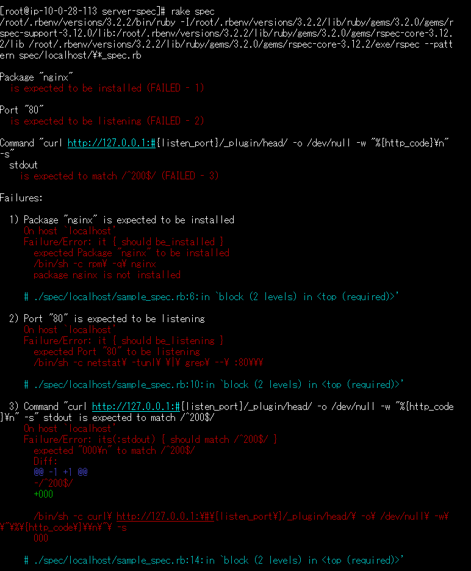
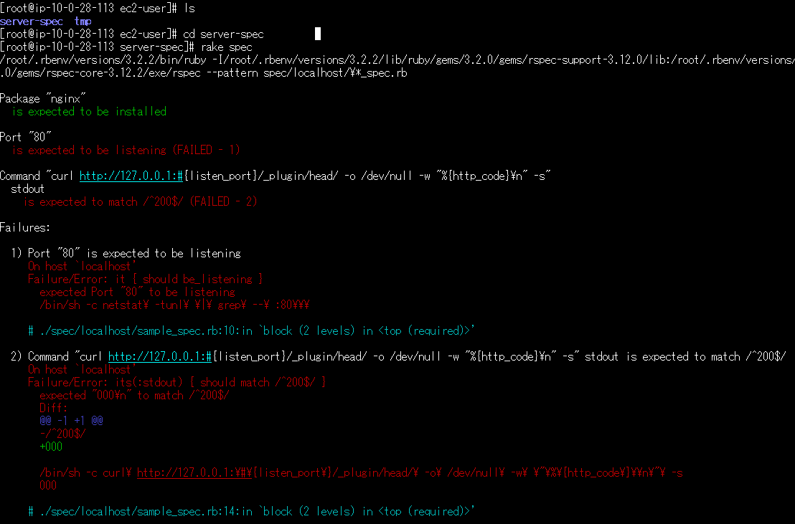
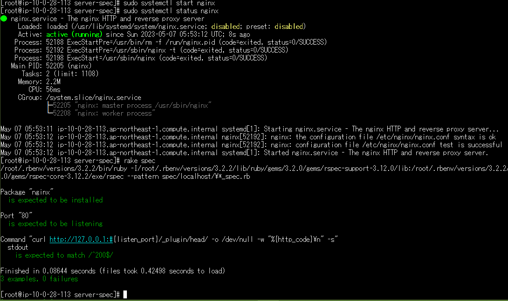
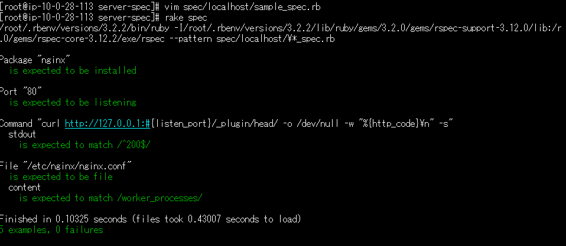

# 第11回課題 Serverspec #
## Serverspec のテストを成功させる ##
今回、テスト用にEC2インスタンスを作成しなおしましたが
下記を選択したことで以前と異なるエラーが発生した為、各種インストールから記載しています。

```bash
AZ：ap-northeast-1c  
AMI：al2023-ami-2023.0.20230503.0-kernel-6.1-x86_64
ruby：3.2.2
```
1. ec2-user内に「server-spec」テスト用のフォルダを作成する
2. 作成したフォルダに移動してパッケージをアップデートする

```bash
$ sudo su
# yum update
 ↓
Nothing to do.　
＊Amazon Linux 2023の為か最新の様子
```

3. Railsアプリを動かすため下記のパッケージをインストールする  **amazon linux 2　の時と異なる**

```bash
# yum -y install gcc-c++ make patch git curl zlib-devel openssl-devel ImageMagick-devel readline-devel libcurl-devel libffi-devel libicu-devel libxml2-devel libxslt-devel
　↓
エラー２）発生
dnf install curl -y --allowerasing　を実行して解消

```

4. JavaScriptを実行できるようNode.jsをインストールする 　**amazon linux 2　の時と異なる**

```bash
# curl -sL https://rpm.nodesource.com/setup_14.x | sudo bash -
　↓
エラー３）発生
You don't appear to be running a supported version of Enterprise Linux.
「リモートの Amazon Linux 2023 ホストに、セキュリティ更新プログラムがありません。」情報あった
　↓
以下コマンドに変更
$ curl -o- https://raw.githubusercontent.com/nvm-sh/nvm/v0.39.3/install.sh | bash
一回SSHを抜けて、SSH再接続
$ nvm install 18
$ node -v　←　v18.16.0
```

5. yarnをインストールする　＊スムーズにできた。

```bash
# curl -sL https://dl.yarnpkg.com/rpm/yarn.repo | sudo tee /etc/yum.repos.d/yarn.repo
# yum -y install yarn
# yarn --version　　⇒　1.22.19
```

6. rubyのバージョン管理ツールであるrbenvをインストールする

```bash
# git clone https://github.com/sstephenson/rbenv.git ~/.rbenv

# echo 'export PATH="$HOME/.rbenv/bin:$PATH"' >> ~/.bash_profile
# echo 'eval "$(rbenv init -)"' >> ~/.bash_profile
# source .bash_profile
```

**ーパスが通らなかったので以下実施ー**

- .bash_profile　の最下部に2行手入力して、`source .bash_profile`　する

```bash
# .bash_profile

PATH=$PATH:$HOME/.local/bin:$HOME/bin

export PATH
export PATH="$HOME/.rbenv/bin:$PATH"　←追加
eval "$(rbenv init -)"　　←追加
```

- 既存の.bash_profileに直接記載しないで別ファイルに記載し.bash_profileから読み込む方法もあるらしい。

[参考情報](https://hitolog.blog/2021/10/13/how-to-ruby-install/)

7. rubyをインストールするためのruby-buildをインストールする　＊スムーズにできた。

```bash
# git clone https://github.com/sstephenson/ruby-build.git ~/.rbenv/plugins/ruby-build

以下のコマンドでインストール可能なrubyのバージョン一覧が表示されれば完了です。
# rbenv install -l
3.0.6
3.1.4
3.2.2
jruby-9.4.2.0
mruby-3.2.0
picoruby-3.0.0
truffleruby-22.3.1
truffleruby+graalvm-22.3.1
```

8. rubyをインストールする 　**amazon linux 2　の時と異なる**

```bash
# rbenv install 3.2.2
　↓
エラー４）発生
まず、以下実施
# yum install libyaml-devel
インストールコマンドを変更
# TMPDIR="${PWD}/tmp" rbenv install 3.2.2

# rbenv rehash
# rbenv global 3.2.2
# ruby -v    →　ruby 3.2.2 (2023-03-30 revision e51014f9c0) [x86_64-linux]
```

9. Railsをインストールする　＊スムーズにできた。

```bash
$ echo "gem: --no-document" >> ~/.gemrc
$ gem install rails 
$ rails -v　→　Rails 7.0.4.3
```

10. Serverspeをインストールする

```bash
$ gem install serverspec
　↓
インストールOK
Successfully installed serverspec-2.42.2
14 gems installed
```

11. Serverspec初期セットアップ　**ローカル環境に対するテスト**

```bash
[root@ip-10-0-28-113 server-spec]# serverspec-init
Select OS type:

  1) UN*X
  2) Windows

Select number: 1

Select a backend type:

  1) SSH
  2) Exec (local)

Select number: 2　←　今回はローカル環境にてテスト実施

 + spec/
 + spec/localhost/
 + spec/localhost/sample_spec.rb
/root/.rbenv/versions/3.2.2/lib/ruby/gems/3.2.0/gems/serverspec-2.42.2/lib/serverspec/setup.rb:155: warning: Passing safe_level with the 2nd argument of ERB.new is deprecated. Do not use it, and specify other arguments as keyword arguments.
/root/.rbenv/versions/3.2.2/lib/ruby/gems/3.2.0/gems/serverspec-2.42.2/lib/serverspec/setup.rb:155: warning: Passing trim_mode with the 3rd argument of ERB.new is deprecated. Use keyword argument like ERB.new(str, trim_mode: ...) instead.
 + spec/spec_helper.rb
 + Rakefile
 + .rspec
```

- Rakefile：rakeコマンドを使ってテストを実行するための設定ファイル
- spec/spec_helper.rb：Serverspecを使ってテストを実行する際のテスト設定などを記述したRubyスクリプト
- spec/localhost/httpd_spec.rb：テストスクリプト本体。デフォルトではWebサーバーの設定テストのための項目がサンプルとして記述されている  

12. `vim sample_spec.rb` 　にてサンプルテストコードに置換する
13. 試しにnginxがない状態でテスト実行してみる　⇒　確かに。。3つとも失敗した。
14. Nginxをインストールするする　**amazon linux 2　の時と異なる**

```bash
https://cs.nginx.com/static/instr/amazonlinux2023.html
こちらに従って以下実施
/etc/ssl/nginx/ ディレクトリを作成
# mkdir -p /etc/ssl/nginx

必須パッケージをインストール
# yum install ca-certificates

NGINX Plus パッケージは必要なさそうなので、以下を実施
# dnf install nginx
　↓
インストールOK
# nginx -v　　→　version: nginx/1.22.1

念のためNginxの権限変更も実施
# cd /var/lib
# sudo chmod -R 775 nginx
```

15. 試しにテスト実行してみる　⇒　Nginxが存在するか？のみ成功！
16. Nginxを起動`systemctl start nginx`してテスト実行してみる  
　　⇒　listenポート、ステータスコード確認も成功！
17. sample_spec.rb　に「nginx.conf」に対するテストを追加してみる　⇒　成功！

```bash
以下を追加
# ファイルが存在するか？　ファイル内にマッチするテキストがあるか？
describe file('/etc/nginx/nginx.conf') do
  it { should be_file }
  its(:content) { should match /worker_processes/ }
end
```
## エビデンス ##
*Nginxインストール前*  
   
*Nginxインストール後*  
  
*Nginx起動後*  
  
*ファイルチェック*  
 

## 遭遇したエラー ##

１）ServerSpecテスト用にEC2を作成してTeraTermから入ろうとしたらSSH接続できない。。  
作成済のサンプルアプリが入っているEC2には同じキーでアクセスできる。。  
⇒　Teraterm では rsa-sha2-256/512 の方式に対応しなくなったとのことで[ED25519] の新しいキーペアを作成して接続OK  
RSAと同程度の安全性であり、RSAよりも鍵長が短く高速に処理できパフォーマンスが良いとのこと

２）以下エラーにて、Railsアプリを動かすため下記のパッケージをインストールに失敗。。  
`package curl-minimal-7.88.1-1.amzn2023.0.1.x86_64 conflicts with curl provid ed by [curl-7.87.0-2.am](http://curl-7.87.0-2.am/)`  
⇒　パッケージ curl-minimal- 7.76.1- 14.el9. x86_64 は、curl-7 が提供する curl と競合してるとのこと。  
   `dnf install curl -y --allowerasing`　を実行して解消

３）以下エラーにて、Node.jsをインストールに失敗。。  
`You don't appear to be running a supported version of Enterprise Linux.`
⇒ Amazon Linux 2023 に対応してない？  
`$ curl -o- https://raw.githubusercontent.com/nvm-sh/nvm/v0.39.3/install.sh | bash`　を実行して解消
[参考情報](https://zenn.dev/yohei_watanabe/articles/dfda076654037f)

４）下記エラーにて、ruby3.2.2がインストールされない。。  
`It seems your ruby installation is missing psych (for YAML output).`  
⇒　Ruby3.2.0のリリースで「libyamlやlibffi」の同梱が廃止されたので別途インストールする必要があるとのこと。  
    `yum install libyaml-devel`　を実行して解消  
更に  
Amazon Linux 2023のEC2にrubyをインストールすると/tmpディレクトリの容量不足でエラー発生。。  
以下にて解消
```bash
ディスク容量を確認
$ df -h

/tmpが100%近いときは以下にてインストールを実施する
$ TMPDIR="${PWD}/tmp" rbenv install 3.2.2
```
[参考情報](https://qiita.com/PRYA/items/50fc2357b4b820d09c45)

## 感想 ##
- AMIやバージョンが変わることで、設定・動作が異なることを実感しました。
- エンジニアは学び続けなければならないと言われる理由も実感しました。
- 最初は、どこをテストしているのか？理解できませんでしたが、ローカル環境に対するテストとネットワーク経由で他のマシンに対しテストを実行する機能があることが分かったので、次回はSSH接続を選択して実施してみたいと思います。
- Nginxをインストール・起動する前からテスト実行してみたことで、何をテストしているのかよく分かりました。
- specディレクトリ以下にディレクトリを追加することで、対象とするホストを追加できるとのことで、確かにインフラの基本チェックツールとして有効であることが実感できました。