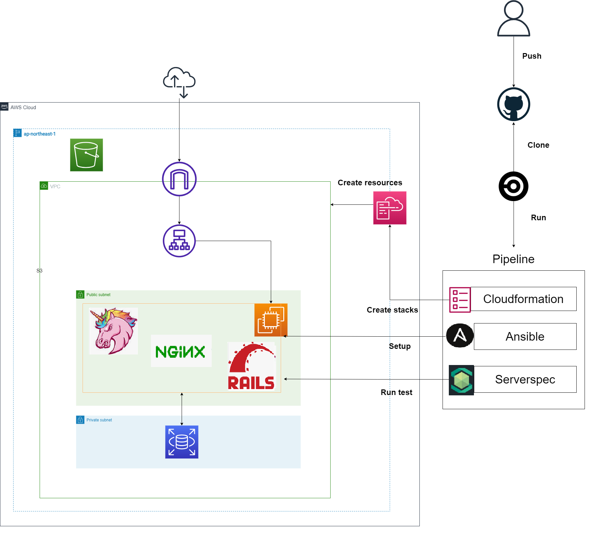

## AWS構成図 ##
### 最終課題にて作成した環境の構成図 ###

### この作業から学んだこと ###
* Circleciのパイプラインを経由する場合の描画方法
* EC2内の構成を描画する方法

## 目次 ##
### [1. CircleCIにてCloudformationを実行させる](lecture13-15_cloudformation.md) ###
### [2. CircleCIにてAnsibleを実行させアプリをデプロイする](lecture13-15_ansible.md) ###
### [3. CircleCIにてServerSpecを実行させる](lecture13-15_serverspec.md) ###
