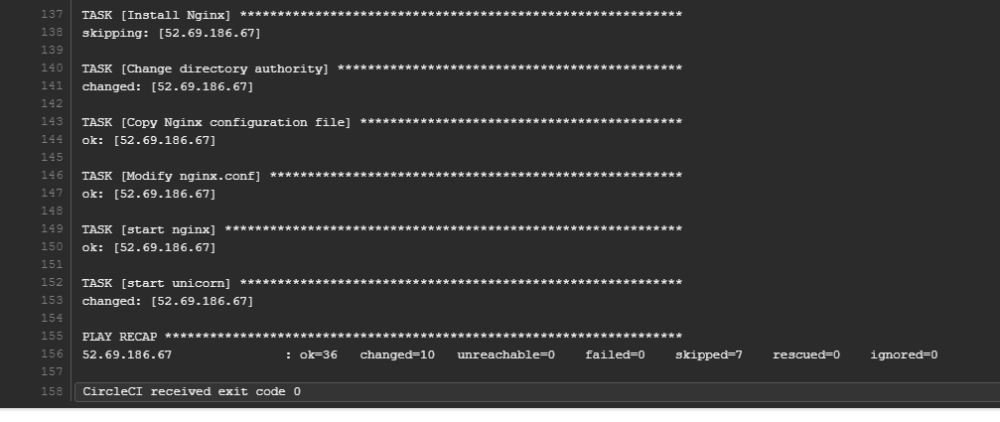
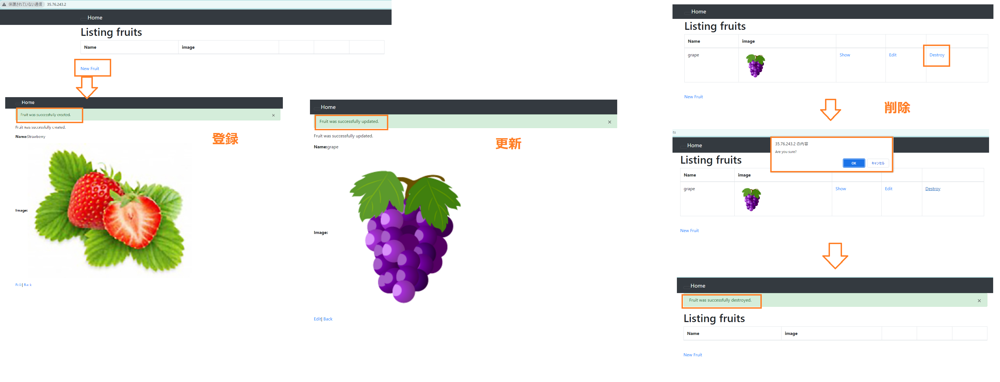

## 2. CircleCIにてAnsibleを実行させアプリをデプロイする ##
#### 2-1. リポジトリのrootにAnsibleのディレクトリ・各ファイルを作成する ####
**「ansible.cfg」ファイル**
- 「StrictHostKeyChecking=no」など、Ansibleの動作や動作オプションをカスタマイズしたい時に作成する  
   必須ではありません。
- デフォルトのインベントリ設定
- SSH接続設定
- プラグインの設定
- Ansibleの動作オプションの設定

**「inventory」ファイル**
- Ansibleが管理する対象のホスト（サーバー）のリストとその属性（グループ、変数など）を定義するファイル  
必須ではないが、非常に便利なツール
- 対象ホストの管理
- グループ化とパターンマッチング
- 変数の定義
- ダイナミックインベントリ

**「playbook.yml」ファイル**
- Ansibleの実行時にタスクとその実行順序を定義するためのファイル
- タスクの宣言的な定義
- 複数のタスクの管理
- ホストやグループの指定
- 変数の使用
#### 2-2. Ansibleの「playbook.yml」にAPPデプロイの設定を記載する ####
- Playbookの記述方法としては、Roleを利用する方法と、Roleを利用しない方法がある
Roleを利用しない場合はtaskを定義する
```bash
---
- name: Playbookの説明
  hosts: ターゲットホストまたはホストグループ
  become: ture  # 特権昇格（sudo）を使用する場合に指定
  become_user: ec2_user # rootユーザ使用であれば省略OK　ユーザーを指定する必要がある場合のみ
  tasks:
    - name: タスクの説明
      モジュール名:
        パラメータ1: 値1
        パラメータ2: 値2
      register: 変数名  # タスクの結果を変数に格納

    - name: 別のタスク
      モジュール名:
        パラメータ1: 値1
        パラメータ2: 値2

    - name: ループを使用するタスク
      モジュール名:
        パラメータ: "{{ item }}"
      with_items:
        - 値1
        - 値2
        - 値3

    - name: 条件分岐を使用するタスク
      モジュール名:
        パラメータ1: 値1
        パラメータ2: 値2
      when: 条件式

  vars:  # playbook全体で使用する変数を定義
    変数1: 値1
    変数2: 値2

  vars_files:  # 外部の変数ファイルを読み込んで変数を設定することができる
    - varsファイル1.yml
    - varsファイル2.yml

```
#### 2-3. CircleCIの「Additional SSH Keys」でHostNameを設定する ####
CircleCIの「Project Settings> SSH Keys****>**** Additional SSH Keys」でHostNameを設定する  
⇒　Fingerprintをメモする　＊「.circleci/config.yml」へ入力する必要あり!
#### 2-4. 「inventory」ファイルにHostNameを設定する ####
[参考情報](https://hitolog.blog/2021/10/12/how-to-install-ansible/)
```bash
# hosts
[server]
<IP ADDRESS>

[server:vars]
ansible_ssh_port=22
ansible_ssh_user=ec2-user
ansible_ssh_private_key_file=~/.ssh/<SECRET KEY>
__working_user=ec2-user
```
#### 2-5. CircleCIの「config.yml」ファイルにAnsibleの実行を追加する ####
＊SSH接続、Ansibleインストール、playbook実行を記載する
```bash
execute-ansible:
    executor: ansible-playbook/default
    steps:
      - add_ssh_keys:
          fingerprints:
            - "手順4でメモした内容"
      - ansible-playbook/install:
          version: 2.9.23
      - ansible-playbook/playbook:
          playbook: ansible/playbook.yml
          playbook-options: '-u ec2user -i ansible/inventory --private_key ~/.ssh/使用する秘密鍵のファイル名'
```
＊playbook-options: '-i ansible/inventory'　でもOK  
＊playbook-options: '-i ansible/inventory --syntax-check'　でドライランできる  
＊playbook-options: '-vvv -i ansible/inventory'　でデバックできる
#### 2-6. GitHubにpushする ####

### エビデンス ###




### 遭遇したエラー ###
- Ansible設定ファイルを追加後、以下エラーが表示されてパイプラインが実行されない
```
Error calling job: 'execute-ansible'
Cannot find orb 'ansible-playbook' looking for command named 'ansible-playbook/install'
```
⇒　**`orbs`** セクションに`ansible` Orbが定義されていなかった。。
- 「Orb orbss/ansible-playbook@0.0.5」を追加したが、以下エラーが表示されてパイプラインが実行されない
```java
To use this orb, an organization admin must opt-in to using third party orbs in Organization Security settings.
```
⇒　Settings＞Security　にてUncertified Orbsを許可する
- AnsibleとPython2ではAnsible2.13.5が使えないエラー
コントロールノードのCloud9で`python --version`と入力すると「Python 3.7.16」になっている、「Python Support」も3になっているけど・・  
⇒　Ansible側を2.9.23にして解消
- `ansible/playbook.yml`が見つからないエラー  
⇒　ファイルは存在しているので、`chmod 755 playbook.yml`　にて実行権限を付与しても同じ  
⇒　Playbook.ymlを作り直したが同じ  
⇒　`ansible-playbook/playbook`コマンドの指定を絶対パスにしてみたが同じ「/home/ec2-user/environment/aws-practice/ansible/playbook.yml」    
⇒　パイプラインの「Set inventory」に「.ansible-playbook-circleci/inventory」フォルダ記載があったので*ansible-playbook/playbook`*マンドの指定を「.ansible-playbook-circleci/playbook.yml」にしてみたが同じ  
⇒　「execute-ansible:」に「- checkout」が無いことが判明！
「- checkout」はGitHubに配置したコードをexecuterに取り込む為の重要なStepであることが分かった
- UNREACHABLE! と表示され、ホスト：EIPでポート：22への接続がタイムアウトとなる  
⇒　ローカルPCからは同じEIPにSSH接続できたので、keyの問題と判明  
⇒　エラーメッセージ `"Failed to connect to the host via ssh: percent_expand: invalid format"` は、パーセント記号 (**`%`**) のエスケープが正しく行われていないことと判明  
⇒　確かに、pemファイル名に (**`%`**) を使っていたので、**`%%`** に置き換えてSuccess！
- `"curl: option -: is unknown",`が表示されてNodeインストールが失敗  
⇒　オプションを「-sL」⇒「-fsSL」に変更⇒　パイプの処理がうまくいかないエラー  
⇒　`command`モジュールを`shell`に変更してSuccess！
　　・シェルの特性を必要としない単純なコマンドの実行には command モジュール  
　　・シェルの機能（例えば、パイプラインや変数展開）を使用するコマンドの実行には shell モジュール
- 「.rbenv」フォルダが作成されない  
⇒　Ansibleで`~`をフルパスにして解消！  
- `rbenv: command not found`　が表示され、Rubyがインストールされない  
⇒　ローカルPCからEC2に入ると「rbenv -v　で1.2.0」が表示される  
⇒　ansible経由の場合は、/bin/shシェルが使用され.bash_profileや.bashrcを読み込む、/bin/bashシェルが使用されないためと判明！

https://www.bunkei-programmer.net/entry/2015/05/16/162020

```java
**ー以下に「bash -lc」を追加したー**

- name: Load .bash_profile
    shell: bash -lc "source /home/ec2-user/.bash_profile"

- name: install ruby
  shell: bash -lc "rbenv install {{ ruby_version }}"

**ansible.cfgに以下を記載してもOK！**
[defaults]
executable = /bin/bash -l
```

- 更に.rbenvフォルダに「shims」「versions」がない為`rbenv: command not found`　が表示されることが判明  
⇒　パスを正しく設定することで、rbenvが「shims」「versions」が作成される  
⇒　ローカルPCからEC2内を確認すると`mkdir: cannot create directory ‘/home/ec2-user/.rbenv/shims’: Permission denid`が表示されていたので、権限がなくて作成されていない  
⇒　playbook全体の権限をrootにしていた為、rbenvもrootになっていた。全体をec2-userにして、必要な箇所をroot指定することで解消！
- [Install Rails]タスクが`skipping`され、インストールされなかった  
⇒　[Check if Rails is installed]の正規表現を「'^rails (7.0.4)$’」⇒「rails | grep 7.0.4」に変更  
⇒　`non-zero return code`　にて処理がストップしたので、「ignore_errors: yes」を追加  
⇒　途中で止まらなくなったが、`skipping`されたwhenモジュールにTypoが判明し、解消！
- `Failed to find required executable gem in paths` と表示され、Railsインストールに失敗する    
⇒　`user_install:no`に設定して`~/.rbenv/`以下にインストールされるように`executable:`でgemのパスを指定してSuccess！
【参考情報】
https://oki2a24.com/2017/05/12/how-to-use-gem-installed-with-rbenv-in-ansible/
https://qiita.com/itiut@github/items/3e1aaa4f2b5d95efb319
- `Download MySQL repository RPM`　にてエラー403となる（アクセスが許可されてない。。）
⇒　まずMySQLのリポジトリのGPG公開鍵を取得し、インストールするパッケージの署名を検証する必要であることが判明⇒　「Import MySQL GPG key」タスクを追加したが、403エラー。。
https://blog.katsubemakito.net/mysql/mysql-update-error-gpg  
⇒　「rpm -ivh」コマンドでダウンロード＆インストールに変更して、インストールOK！

- 次のタスク実行時に既にインストールされているエラーで止まったので「rpm -Uvh」に変更したが同じ　https://blog.apar.jp/linux/9868/  
⇒　`creates`*パラメータを使用して既にインストールされているかどうかをチェックする処理を追加して解消！
- `Failed to build gem native extension.`　が表示され「Install Bundler」が失敗  
⇒　手動デプロイ時同様、EC2のボリュームを16GBに変更したら完了できた。
＊次回はEC2のスタックでボリューム増設を設定しよう！
- `No such file or directory` が表示され「config/database.yml.sample」のファイル名を変更できない⇒　フルパスにしてSuccess！

- `No such file or directory` が表示され「rails db:create」が失敗する  
⇒　which rails コマンドでrails コマンドの実行パスを確認   
⇒　手動デプロイアプリと同じ場所に存在していた「/.rbenv/shims/rails」  
⇒　bundlerを経由するようにコマンド`bundle exec rails db:create`にしても同じエラ-  
⇒　command⇒　shellに変えたら、Success！
＊シェルの機能が必要な場合やコマンドの結果を変数として利用したい場合は、`shell`モジュールを使用することが適しています。

- `rails s -b 0.0.0.0`でアプリ起動に成功しているが、ブラウザからアクセスすると「このサイトにアクセスできません」となる  
⇒　ローカルPCからアクセスしてアプリ起動すると閲覧出来る

**以下に当たる**  
```bash
https://pikawaka.com/rails/rails-s 
このサーバ自体は、開発用のPC上に作られたものです。外部に公開しているわけではないので、他のPCからブラウザ経由でアプリケーションにアクセスすることはできません。
```  
⇒　今回はデプロイが目的のため、pumaではなくNginx＋Unicornで起動させる必要あり  
- `bundle: command not found`　 が表示され、unicornが起動できない  
⇒　「bash -lc」を付けることで解消
- `Could not locate Gemfile or .bundle/ directory`が表示され、unicornが起動できない  
⇒　`args:`モジュールでアプリディレクトリを指定することで起動OK！

### この作業から学んだこと ###
* circleci.ymlに構文エラーがあるとパイプラインが開始されない
* 「- checkout」はジョブごとに毎回必要
* コマンド実行のモジュールが2つある「command」「shell」
* 「command」「shell」の違い
* APP起動のための環境構築はパスや権限よるエラーがありがち
* 既にインストール済かをチェックしてからインストールを行なう形がよい
