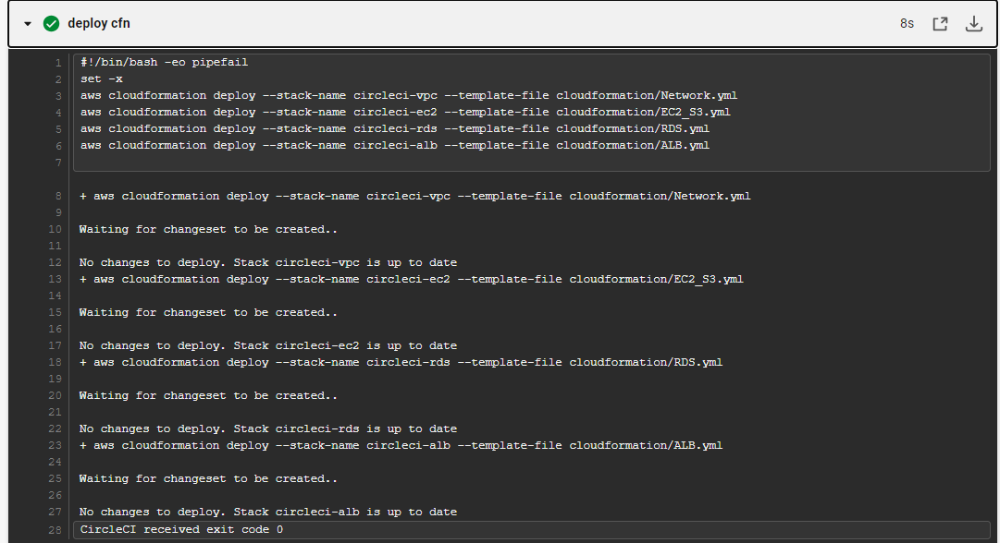

## 1. CircleCIにてCloudformationを実行させる ##
#### 1-1 CircleCIとGitHubの連携 ####
 - CircleCIにGitHubアカウントでログインする
 - CircleCIと連携させるリポジトリを選択する  
#### 1-2 リポジトリのrootに「.circleci」フォルダを作成し、中に「config.yml 」ファイル作成する ####
＊Cloudformationの前に、lintツールのみでテストしてみる
```bash
version: 2.1
orbs:
  python: circleci/python@2.0.3
jobs:
  cfn-lint:
    executor: python/default
    steps:
      - checkout
      - run: pip install cfn-lint
      - run:
          name: run cfn-lint
          command: |
            cfn-lint -i W3002 -t lecture10/*.yml
workflows:
  raisetech:
    jobs:
      - cfn-lint
```
##### ＜Orb の概要＞ #####
https://circleci.com/docs/ja/orb-intro/  
Orb は、再利用可能なコードスニペットです。  
Orb を使用すると、繰り返しのプロセスを自動化でき、手早くプロジェクトをセットアップできます。  
サードパーティ製ツールとの連携も容易になります。  
Orb は、 *名前空間* と *Orb 名* から成る *スラグ* で指定します。
```bash  
orbs キーの後に、インポートする Orb を表す orb-name キーを記述します。 
orb-name キーの値には、Orb スラグとバージョンを指定します。

version: 2.1

orbs:
  orb-name: <namespace>/<orb-name>@1.2.3
```

##### ＜Orb を使用するメリット＞ #####
- 設定ファイルの要素をパラメーター化できるため、設定を大幅に簡素化できます。
- パラメーター化された設定を 1 回記述するだけで、それをいくつもの類似したプロジェクトで利用できるようになります。
- [独自の Orb を開発してパブリッシュ](https://circleci.com/docs/ja/orb-author-intro/)することもできます。
#### 1-3. CircleCIに環境変数を設定する ####
- CircleCI アプリケーションで、以下の*プロジェクト環境変数*を設定します。
https://circleci.com/docs/ja/ecs-ecr/  
```bash  
AWS_ACCESS_KEY_ID
AWS_SECRET_ACCESS_KEY
AWS_REGION
```
#### 1-4. GitHubにpushして実行させる ####
 ⇒　Lintツールは成功！
#### 1-5．EC2にElastic IPを割り当てる  ####
  ＊既存のIPアドレスをEC2に割り当てる方法
```bash
IPAssoc:
        Type: AWS::EC2::EIPAssociation
        Properties:
            InstanceId: !Ref スタックで作成したEC2の論理ID
            EIP: 既存のElasticIP
```
#### 1-6. 「config.yml」にClooud Formationの実行の記述を追加 #### 
  ```bash  
execute-cfn:
    executor: aws-cli/default
    steps:
      - checkout  # 毎回必要 
      - aws-cli/setup:
          aws-access-key-id: AWS_ACCESS_KEY_ID
          aws-region: AWS_DEFAULT_REGION
          aws-secret-access-key: AWS_SECRET_ACCESS_KEY
      - run:
          name: deploy cfn
          command: |
            set -x  
            # シェルスクリプト内で使用されると、実行されるコマンドの前に実行されるようになる
            aws cloudformation deploy --stack-name circleci-vpc --template-file cloudformation/Network.yml
            aws cloudformation deploy --stack-name circleci-ec2 --template-file cloudformation/EC2_S3.yml
            aws cloudformation deploy --stack-name circleci-rds --template-file cloudformation/RDS.yml
            aws cloudformation deploy --stack-name circleci-alb --template-file cloudformation/ALB.yml
  ```
#### 1-7. GitHubにpushする ####

### エビデンス ###



### 遭遇したエラー ###
-  構文エラー  
⇒　`--template-file`の記載がファイル毎に必要だった
- `Failed to create/update the stack.`　が表示される  
⇒　失敗に至るまでのイベントのリストを取得する以下コマンドを実行
  `aws cloudformation describe-stack-events --stack-name stack-for-circleci`  
- `Unknown options:` が表示される
⇒　ロールバック完了の記載のみ  
⇒　templateを1行づつ記載する  
⇒　VPC作成完了のあとEC2作成時に「UPDATE_IN_PROGRESS」になって失敗。。  
⇒`circleci-vpn`のデプロイ時に `--no-change-set-execute` オプション、`--no-fail-on-empty-changeset` オプションを付けてみたが同じ  
[【参考情報】](https://dev.classmethod.jp/articles/introducing-no-fail-on-empty-changeset-option-for-aws-serverless-application-model/)  
⇒　各デプロイのスタック名が同じだった。。  
スタック名が同じだと一方のスタックの更新が他のスタックに影響することが分かった

### この作業から学んだこと ###
* circleci.ymlの構成
* Orb の使い方
* AWS　CLIを利用する時は、アクセスキー＋シークレットアクセキーが必要
* スタック名が同じだと更新処理になる為、新規作成したい時は異なる名前にする