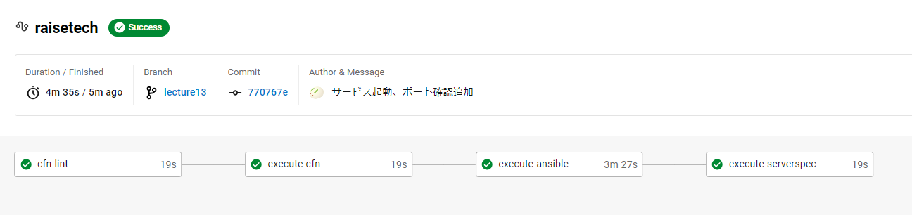
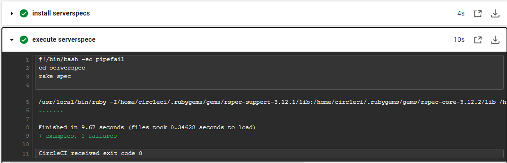

## 3. CircleCIにてServerSpecを実行させる ##
#### 3-1. リポジトリのrootにServerSpecのディレクトリ・各ファイルを作成する ####
**「/spec/test-server」ディレクトリ**
- テスト対象サーバーが判別できる名前にする
- この名前がRakefileでホスト名として使用される  
**「/spec/test-server/sample_spec.rb」ファイル**
- 実際にテストする内容を記載するファイル  
**「/spec/spec_helper.rb」ファイル**
- テストに関する全般的な設定ファイル
- ローカルでのテストかSSH接続でのテストかによって記載が異なる
- 今回はSSH接続にて実施  
**「Rakefile」ファイル**
- テスト実行のためのタスク定義ファイル
- ./specの下にある各サブディレクトリに対して、Serverspecのテストを個別に実行するためのRakeタスクを記述したファイル
- ./spec以下のディレクトリをホスト名として使用している

### 3-2. 「「config.yml＞Ansible」にServerspecで使用する鍵を生成＆保存する記述を追加する ###
・鍵の生成
```bash
- run:
          name: Generate SSH Key
          command: |
            echo "yes" | ssh-keygen -t rsa -b 4096 -f ~/.ssh/id_rsa_serverspec -N ""
            chmod 600 /home/circleci/.ssh/id_rsa_serverspec
            echo "Generated SSH keys:"
            ls ~/.ssh/id_rsa*
```
・ Ansibleで公開鍵をEC2のauthorized_keysに追加
```bash
- run:
          name: Add SSH key to EC2
          command: |
            ansible-playbook -i '52.69.186.67,' ansible/add_key.yml
```
・Serverspecにて使用するためCircleCIワークスペースに保存
```bash
- persist_to_workspace:
          root: ~/.ssh/
          paths:
            - id_rsa_serverspec
```
### 3-3. 「config.yml＞Serverspec」にAnsibleで保存したキーを使用する記述を追加する ###
・Serverspecジョブで鍵をアタッチ
```bash
- attach_workspace:
          at: /home/circleci/.ssh/
```
・作成した鍵ファイルの権限を変更
```bash
- run:
          name: Set correct permissions for SSH key
          command: |
            chmod 600 /home/circleci/.ssh/id_rsa_serverspec
```
### 3-4. 「「config.yml＞Serverspec」にServerspecインストール⇒実行までを記述する ###
```bash
- run:
          name: install serverspecs
          command: |
            gem install serverspec
            # 「NotImplementedError:サポートされていないキータイプ `ssh-ed25519'」エラー解消のため追加
            gem install ed25519 bcrypt_pbkdf
      - run: 
          name: execute serverspece
          command: |
            cd serverspec
            rake spec
```
### 3-5．「/spec/sample_spec.rb」ファイルにテストを作成して記述する ###
＜インストール確認＞
```bash
describe package('パッケージ名') do
  it { should be_installed }
end
```
＜指定した記述が存在するかの確認＞
```bash
describe file('ファイルパス') do
  it { should be_file }
  its(:content) { should match /user ec2-user;/ }
end
```
＜サービス起動の確認＞
```bash
describe service('サービス名') do
  it { should be_running }
end
```
＜ポート確認＞
```bash
describe port(ポート番号) do
  it { should be_listening }
end
```
＜レスポンス確認＞
```bash
describe command('curl http://127.0.0.1:#{listen_port}/_plugin/head/ -o /dev/null -w "%{http_code}\n" -s') do
  its(:stdout) { should match /^ステータスコード$/ }
end
```
### 3-6. GitHubにpushする ###

### エビデンス ###



### 遭遇したエラー ###
- インストール成功したが、`No Rakefile found`　が表示されてテストが実行されない  
⇒　テスト実行前に`cd serverspec`を追加して解消！
- 「NotImplementedError:サポートされていないキータイプ `ssh-ed25519'」エラーが表示されてテストが失敗する。。  
⇒　「ssh-ed25519'」や「ed25519」サポートのためにnet-sshに以下のgemが必要
　　　＊ed25519 (バージョンは1.2以上、2.0未満)
　　　＊bcrypt_pbkdf (バージョンは1.0以上、2.0未満)  
⇒　**`gem install ed25519 bcrypt_pbkdf`**　を追加して解消！
- `Could not locate Gemfile or .bundle/ directory`　が表示される  
⇒　「~/.ssh/config」ファイルを作成したことで解消！
- 「Net::SSH::AuthenticationFailed:」が表示されて対象とするサーバーにログインできない  
⇒　以下がチェックポイント
```java
1. **ユーザー名が正しい**：SSH接続に使用するユーザー名がテスト対象のサーバーで有効であることを確認してください。一部の環境では、特定のユーザー名（たとえば`ubuntu`や`ec2-user`）がデフォルトで設定されています。ユーザー名が間違っていると、認証エラーが発生します。

2. **秘密鍵が正しい**：SSH接続に使用する秘密鍵がテスト対象のサーバーで有効で、かつその秘密鍵に対応する公開鍵がサーバーの`~/.ssh/authorized_keys`ファイルに追加されていることを確認してください。秘密鍵が間違っている、または公開鍵がサーバーに設定されていないと、認証エラーが発生します。

3. **接続設定が正しい**：CircleCIの設定ファイル（`.circleci/config.yml`）や`spec/spec_helper.rb`などでSSH接続の設定を行っている部分が正しいことを確認してください。たとえば、`set :host`や`set :ssh_options`で設定する接続先のホスト名、ユーザー名、秘密鍵のパスなどが間違っていると、認証エラーが発生します。
```  
⇒　Circleci上で.ssh内を確認して秘密鍵のパスが判明  
⇒　Ansibleの環境構築は今まで通りfingerprintsを用い、Serverspecのjobでは鍵を新規作成することにした　
- Ansibleで鍵生成は成功するが、Serverspecで見つからない  
⇒　`persist_to_workspace`ステップはAnsibleのjob、`attach_workspace`ステップはServerspecのjobに分けて解決した！

### この作業から学んだこと ###
* serverspec-initを使わないファイル作成方法
* ターゲットノードにSSH接続して実行する時の手順
* Ansibleのjobで鍵を生成できること
* 「persist_to_workspace:」にてCircleCIワークスペースに保存、「attach_workspace:」にて利用できること
* 改めて公開鍵・秘密鍵のしくみ、ファイル名、パス